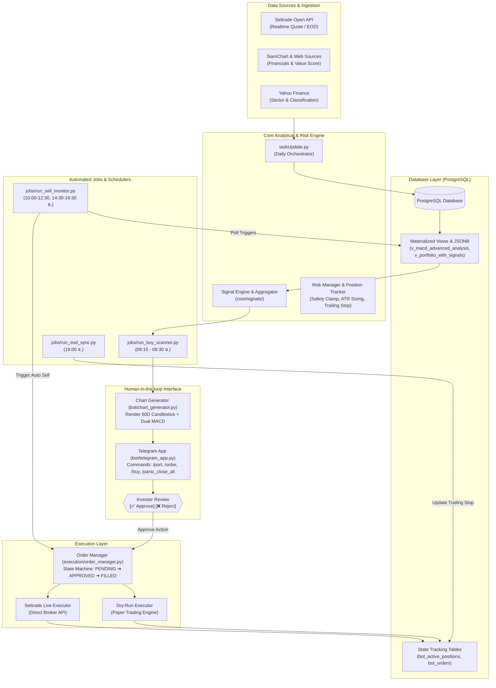

# Thai Stock Screener & Algorithmic Trading Bot

<div align="center">

[](#-beta-version-notice)
[](#)
[](#)
[](#)
[](#)

**ระบบคัดกรองหุ้นทางเทคนิคและพื้นฐาน พร้อมระบบบริหารความเสี่ยงและการส่งคำสั่งเทรดอัตโนมัติแบบกึ่งอัตโนมัติ (Semi-Automated) สำหรับตลาดหลักทรัพย์แห่งประเทศไทย (SET / mai)**

</div>

---

> [!WARNING]
> ### ⚠️ BETA VERSION NOTICE
> ซอฟต์แวร์นี้อยู่ในช่วงการพัฒนาและทดสอบความเสถียร (**Beta Version**) คุณลักษณะและอัลกอริทึมบางส่วนอาจมีการปรับปรุงเพิ่มเติมอย่างต่อเนื่อง
> 
> - ขอแนะนำให้เปิดใช้งานในโหมดจำลองคำสั่ง (**Dry-Run Mode: `true`**) ก่อนเริ่มส่งคำสั่งเทรดจริง
> - การลงทุนในตลาดหลักทรัพย์มีความเสี่ยง ผู้ใช้งานควรทำความเข้าใจกลยุทธ์ อัตราทด และการตั้งค่าระบบบริหารความเสี่ยง (`bot_config.json`) ให้ถี่ถ้วนก่อนเชื่อมต่อพอร์ตการลงทุนจริง

---

## 📌 สารบัญ (Table of Contents)
- [บทนำและหน้าที่ของโปรแกรม (Overview)](#-บทนำและหน้าที่ของโปรแกรม-overview)
- [คุณสมบัติหลักของระบบ (Key Features)](#-คุณสมบัติหลักของระบบ-key-features)
- [สถาปัตยกรรมการทำงาน (System Architecture)](#-สถาปัตยกรรมการทำงาน-system-architecture)
- [โครงสร้างไดเรกทอรี (Directory Structure)](#-โครงสร้างไดเรกทอรี-directory-structure)
- [สิ่งที่ต้องเตรียมล่วงหน้า (Prerequisites)](#-สิ่งที่ต้องเตรียมล่วงหน้า-prerequisites)
- [ขั้นตอนการติดตั้งและกำหนดค่า (Installation & Setup)](#-ขั้นตอนการติดตั้งและกำหนดค่า-installation--setup)
- [การตั้งค่าระบบบอท (Configuration Guide)](#-การตั้งค่าระบบบอท-configuration-guide)
- [คำสั่งควบคุมผ่าน Telegram Bot](#-คำสั่งควบคุมผ่าน-telegram-bot)
- [การตั้งเวลาทำงานอัตโนมัติ (Automation & Scheduling)](#-การตั้งเวลาทำงานอัตโนมัติ-automation--scheduling)
- [การทดสอบความพร้อมของระบบ (System Suite Test)](#-การทดสอบความพร้อมของระบบ-system-suite-test)
- [ข้อสงวนสิทธิ์ความรับผิดชอบ (Disclaimer)](#-ข้อสงวนสิทธิ์ความรับผิดชอบ-disclaimer)

---

## 🎯 บทนำและหน้าที่ของโปรแกรม (Overview)

**Thai Stock Screener** เป็นโซลูชันแบบครบวงจร (End-to-End Quantitative Pipeline) สำหรับนักลงทุนในตลาดหุ้นไทย ถูกออกแบบให้รองรับการทำงานต่อเนื่อง 24 ชั่วโมง บนเครื่องเซิร์ฟเวอร์ขนาดเล็ก หรือ Raspberry Pi เพื่อทำหน้าที่ทดแทนกระบวนการติดตามเฝ้าหน้าจอ โดยมีหน้าที่หลัก 4 ด้าน:

1. **การดึงและประมวลผลข้อมูลตลาด (Data Ingestion & Fundamental Analysis)**  
   รวบรวมข้อมูลราคาปิดสิ้นวัน (EOD Candles) ของหุ้นทุกตัวใน SET และ mai ผ่าน Settrade Open API ผสานกับข้อมูลงบการเงินและคะแนนมูลค่าเชิงคุณภาพ (Value Score) จาก SiamChart และ Yahoo Finance เพื่อคัดกรองเฉพาะหุ้นที่มีพื้นฐานแข็งแกร่ง
2. **การวิเคราะห์สัญญาณเชิงเทคนิค (Quantitative Technical Screener)**  
   คำนวณ Technical Indicators สำคัญ (EMA, RSI, MACD, ATR ฯลฯ) ผ่านสถาปัตยกรรม PostgreSQL + Materialized Views และสแกนหาจังหวะซื้อด้วยระบบ Plug-and-Play Signals (เช่น MACD Momentum Acceleration, Hybrid Screener)
3. **การอนุมัติคำสั่งแบบมีส่วนร่วม (Human-in-the-Loop via Telegram)**  
   เมื่อระบบตรวจพบจังหวะการเข้าซื้อ จะสร้างรูปชาร์ตกราฟแท่งเทียนพร้อมอินดิเคเตอร์ส่งตรงเข้า Telegram ทันที โดยมีปุ่มให้ผู้ใช้เลือกกด **Approve**, ปรับจำนวนหุ้น/ราคา หรือกด **Reject** ป้องกันการยิงคำสั่งผิดพลาดโดยไม่ผ่านการตัดสินใจของมนุษย์
4. **การบริหารความเสี่ยงและตัดขายอัตโนมัติ (Risk Management & Auto-Execution)**  
   คำนวณขนาดไม้ (Position Sizing) ตามความผันผวนของราคา (ATR) และคอยเฝ้าระวังราคาในพอร์ตระหว่างวันทำการ หากราคาหลุดเส้น Stop Loss (Initial SL พร้อม Safety Clamp), จุดตัดขาดทุนขั้นเด็ดขาด (Hard Cut Loss) หรือ Trailing Stop ระบบสามารถส่งคำสั่งตัดขายเข้าพอร์ตโบรกเกอร์ทันทีแบบเรียลไทม์

---

## ✨ คุณสมบัติหลักของระบบ (Key Features)

- **Plug-and-Play Signal Engine:** โครงสร้างระบบสัญญาณแยกเป็นโมดูลอิสระ (`core/signals/`) สืบทอด Interface มาตรฐาน เพิ่มกลยุทธ์ใหม่ได้โดยไม่ต้องแก้ไขส่วนส่งคำสั่ง
- **Automated Candlestick Chart Generation:** สร้างภาพกราฟแท่งเทียน Candlestick 60 วันย้อนหลัง พร้อมเส้น EMA (12, 26), Dual MACD Histogram และแถบ Volume ในหน่วยความจำ ส่งแจ้งเตือนได้ทันที
- **Safety Clamp & Dynamic Trailing Stop:**  
  - Initial Stop Loss ถูกล็อกด้วย Safety Clamp (ระหว่าง 4.0% - 8.0%) อ้างอิงตามค่า ATR ประจำตัวหุ้น
  - ขยับ Trailing Stop ตามระดับราคาสูงสุดที่ทำได้ (`max_price_reached`) สิ้นวันอัตโนมัติ
  - Hard Cut Loss Circuit Breaker ตัดขายทันทีเมื่อพอร์ตขาดทุนเกินเกณฑ์ที่กำหนด (Default: -10.0%)
- **Multi-Layer Safety Limits:** มีการควบคุมงบประมาณรายวัน (`max_amount_per_trade_thb`, `max_amount_per_day_thb`), ลิสต์หุ้นยกเว้น (`excluded_symbols`) เพื่อปกป้องหุ้นลงทุนระยะยาว
- **Dual Execution Engine:** รองรับทั้งโหมดจำลองการซื้อขาย (`dry_run: true`) ซึ่งบันทึกประวัติเสมือนลงฐานข้อมูล และโหมดส่งคำสั่งซื้อขายจริง (`dry_run: false`) ผ่าน Settrade Open API SDK
- **Emergency Circuit Breaker:** คำสั่งฉุกเฉิน `/panic_close_all` บน Telegram สั่งยกเลิก Order ค้างทั้งหมดและสั่งตัดขายหุ้นทุกไม้ที่บอทดูแลในพริบตา

---

## 🏗 สถาปัตยกรรมการทำงาน (System Architecture)



---

## 📂 โครงสร้างไดเรกทอรี (Directory Structure)

```text
thai-stock-screener/
├── .env                                       # ตัวแปรระบบ Credential และ API Keys (ไม่นำขึ้น Git)
├── .env.example                               # เทมเพลตตัวอย่างสำหรับการตั้งค่า Environment
├── requirements.txt                           # รายการ Python Packages ที่จำเป็น
├── initialApp.py                              # โมดูลโหลด Config และเชื่อมต่อ Database/Settrade
├── taskUpdate.py                              # Master Pipeline อัปเดตราคา, ข้อมูลพื้นฐาน และสัญญาณ EOD
├── generate_trade_plan.py                     # สคริปต์คำนวณแผนการเทรดและขนาดไม้เบื้องต้น
├── risk_manager.py                            # ระบบคำนวณ Risk Per Trade และ Portfolio Heat
├── test_system_suite.py                       # สคริปต์ทดสอบความพร้อมทั้งระบบก่อนเปิดใช้งาน
│
├── config/
│   └── bot_config.json                        # ค่าคงที่และสวิตช์ควบคุมระบบเทรด (Dry-Run, Slopes, Limits)
│
├── core/                                      # แกนกลางระบบสัญญาณและการคัดกรอง
│   ├── audit_logger.py                        # บันทึกประวัติเหตุการณ์และ Audit Log
│   ├── position_tracker.py                    # ตรวจสอบประวัติราคา, Initial SL และขยับ Trailing Stop
│   ├── tick_utils.py                          # คำนวณช่วงราคาตามช่อง Tick ของตลาดหลักทรัพย์ (SET)
│   └── signals/                               # สัญญาณเชิงปริมาณแบบ Plug-and-Play
│       ├── base_signal.py                     # Base Class สำหรับสร้าง Signal Engine ใหม่
│       ├── macd_signal.py                     # โมดูลคัดกรองสัญญาณ Dual MACD Momentum
│       ├── hybrid_signal.py                   # โมดูลคัดกรองสัญญาณ Fundamental + Technical
│       └── aggregator.py                      # รวมและจัดลำดับความสำคัญของสัญญาณซื้อ-ขาย
│
├── execution/                                 # ระบบควบคุมและส่งคำสั่งซื้อ-ขาย
│   ├── order_manager.py                       # State Machine ควบคุมวงจรคำสั่งซื้อขาย
│   ├── dry_run_executor.py                    # จำลองการจับคู่คำสั่งและบันทึกสถานะพอร์ตจำลอง
│   └── settrade_executor.py                   # ส่งคำสั่งและตรวจสอบสถานะจริงผ่าน Settrade Open API
│
├── bot/                                       # ส่วนติดต่อผู้ใช้ผ่าน Telegram
│   ├── telegram_app.py                        # แอปรัน Telegram Bot รับคำสั่ง /port, /buy, /order ฯลฯ
│   ├── callback_handlers.py                   # จัดการ Event ปุ่มกด Approve/Reject และปรับขนาดไม้
│   └── chart_generator.py                     # Render กราฟ Candlestick + EMA + MACD เป็นรูปภาพ
│
├── jobs/                                      # งานประจำรอบเวลา (Task Runners / Cron Jobs)
│   ├── run_buy_scanner.py                     # สแกนหาหุ้นที่เข้าเกณฑ์และยิงแจ้งเตือนขอ Approve
│   ├── run_sell_monitor.py                    # เฝ้าระวังพอร์ตช่วงตลาดเปิดและตัดขายอัตโนมัติเมื่อหลุด SL
│   ├── run_eod_sync.py                        # ปรับปรุง Trailing Stop และสรุปพอร์ตสิ้นวัน
│   └── sync_order_status.py                   # ตรวจสอบสถานะ Matching ของคำสั่งที่ส่งเข้าตลาด
│
├── update/                                    # โมดูลดึงข้อมูลตลาดและประมวลผลงบการเงิน
│   ├── updateStockList.py                     # อัปเดตรายชื่อหุ้นทั้งหมดในตลาด
│   ├── updateStockInfo_siamChart.py           # รวบรวมงบการเงินและอัตราส่วนทางการเงิน
│   ├── stockScore_siamChart.py                # คำนวณคะแนน Value Score ประจำรอบ
│   ├── updateStockPrice.py                    # ดึงข้อมูลแท่งเทียนราคาสิ้นวัน (EOD)
│   ├── updatePort.py                          # ดึงสถานะหุ้นในพอร์ตโฟลิโอปัจจุบัน
│   └── master_stock_classification.py         # จำแนกประเภทหลักทรัพย์และ Sector
│
├── indicators/                                # โมดูลคำนวณทางเทคนิคอล
│   ├── compute_indicators_v5.py               # คำนวณ EMA, MACD, RSI, ATR บันทึกลง PostgreSQL (JSONB)
│   └── compute_signalsV2.py                   # สร้างสัญญาณทางเทคนิคและอัปเดต View
│
└── database/                                  # ไฟล์ Schema, DDL และ Database Views
    ├── stockEquity_260910.sql                 # โครงสร้างตารางและ View ของระบบ
    └── create_bot_system_logs.sql             # ตารางสำหรับบันทึก System Logs
```

---

## ⚙️ สิ่งที่ต้องเตรียมล่วงหน้า (Prerequisites)

1. **Python:** เวอร์ชัน 3.10 ขึ้นไป
2. **PostgreSQL:** เวอร์ชัน 14 ขึ้นไป พร้อมสิทธิ์การสร้าง Database, Tables และ Materialized Views
3. **Settrade Open API Account:** ได้รับ `app_id`, `app_secret`, `broker_id` และ `account_no` จากทางโบรกเกอร์
4. **Telegram Bot:** ได้รับ `TELEGRAM_BOT_TOKEN` จาก [@BotFather](https://t.me/BotFather) และ `TELEGRAM_CHAT_ID` ของผู้ใช้งาน

---

## 🚀 ขั้นตอนการติดตั้งและกำหนดค่า (Installation & Setup)

### 1. โคลนคลังโค้ด (Clone Repository)
```bash
git clone https://github.com/Keng-Sahachart/thai-stock-screener.git
cd thai-stock-screener
```

### 2. สร้างและเปิดใช้งาน Virtual Environment
**บน Linux / Raspberry Pi:**
```bash
python3 -m venv .venv
source .venv/bin/activate
```

**บน Windows (PowerShell):**
```powershell
python -m venv .venv
.\.venv\Scripts\Activate.ps1
```

### 3. ติดตั้ง Dependencies
```bash
pip install --upgrade pip
pip install -r requirements.txt
```

### 4. กำหนดค่าตัวแปรระบบ (.env)
คัดลอกไฟล์ `.env.example` เป็น `.env` และกรอกข้อมูลเชื่อมต่อให้ครบถ้วน:
```bash
cp .env.example .env
```
ตัวอย่างการตั้งค่าภายใน `.env`:
```env
# Settrade Open API Configuration
app_id="YOUR_APP_ID"
app_secret="YOUR_APP_SECRET"
account_no="YOUR_ACCOUNT_NUMBER"

# PostgreSQL Database Configuration
posql_host="localhost"
posql_port="5432"
posql_db="stocks"
posql_user="postgres"
posql_password="YOUR_DB_PASSWORD"

# Telegram Bot Integration
TELEGRAM_BOT_TOKEN="123456789:ABCdefGHIjklMNOpqrSTUvwxYZ"
TELEGRAM_CHAT_ID="987654321"

# Third-party APIs (Optional)
TWELVEDATA_API_KEY=""
```

### 5. ติดตั้งโครงสร้างฐานข้อมูล (Database Schema)
นำเข้าฐานข้อมูลและ View ต่างๆ เข้าสู่ PostgreSQL:
```bash
psql -h localhost -U postgres -d stocks -f database/stockEquity_260910.sql
psql -h localhost -U postgres -d stocks -f database/create_bot_system_logs.sql
```

---

## 🛠 การตั้งค่าระบบบอท (Configuration Guide)

ตั้งค่าการทำงานและข้อกำหนดด้านความปลอดภัยได้ที่ไฟล์ `config/bot_config.json`:

```json
{
    "trading_mode": {
        "dry_run": true,
        "description": "true = โหมดทดสอบจำลองคำสั่ง (Paper Trade), false = ยิงเข้า Broker จริง"
    },
    "auto_sell_controls": {
        "enable_auto_cut_loss": true,
        "enable_auto_stop_loss": true,
        "enable_auto_trailing_stop": true,
        "enable_auto_technical_sell": false,
        "description": "สวิตช์สั่งขายอัตโนมัติ: หากตั้งเป็น false ระบบจะแจ้งเตือนผ่าน Telegram เท่านั้น (Alert Only)"
    },
    "tick_execution": {
        "buy_ticks": -1,
        "sell_profit_ticks": 1,
        "description": "buy_ticks: ช่องราคาซื้อเมื่อส่งแบบ Limit (0=Best Offer, -1=บิดซ้าย 1 ช่อง), sell_profit_ticks: ช่องราคาขายเหนือตลาด"
    },
    "budget_limits": {
        "max_amount_per_trade_thb": 2000.0,
        "max_shares_per_trade": 500,
        "max_amount_per_day_thb": 8000.0,
        "max_trades_per_day": 99,
        "min_lot_size": 100,
        "fee_buffer_pct": 0.0025
    },
    "risk_management": {
        "risk_per_trade_pct": 0.01,
        "hard_cut_loss_pct": -10.0,
        "safety_clamp": {
            "min_stop_pct": 4.0,
            "max_stop_pct": 8.0
        },
        "max_position_pct": 0.20,
        "atr_multiplier": {
            "EQUITY": 2.0,
            "ETF": 3.0,
            "MUTUALFUND": 3.0,
            "DEFAULT": 2.0
        }
    },
    "excluded_symbols": [
        "TEAM", "QH", "PIN", "KIAT", "SIAM", "SENA", "TPIPP", "CHG", "TPLAS", "SMD100", "NOBLE-W3"
    ]
}
```

---

## 📱 คำสั่งควบคุมผ่าน Telegram Bot

เมื่อเปิดใช้งาน `bot/telegram_app.py` ผู้ใช้งานสามารถสั่งการและตรวจสอบระบบผ่าน Telegram ได้ดังนี้:

| คำสั่ง (Command) | คำอธิบายการทำงาน |
| :--- | :--- |
| `/port` | แสดงรายการหุ้นที่ถืออยู่, กำไร/ขาดทุนปัจจุบัน, ระดับ Stop Loss, เงินสด และอำนาจซื้อ |
| `/update_port` | ซิงค์ยอดเงินสดและสถานะพอร์ตล่าสุดจาก Settrade (ใช้เมื่อมีการฝาก/ถอนเงิน) |
| `/scan` | สั่งให้ระบบเริ่มสแกนหาจังหวะซื้อทันที พร้อมสร้างภาพกราฟส่งขออนุมัติ |
| `/buy <SYM> [VOL] [PRICE]` | ส่งคำสั่งซื้อหุ้นแบบ Manual พร้อมปุ่มปรับเปลี่ยนจำนวนและราคาผ่าน Inline Keyboard |
| `/order` | ตรวจสอบรายการคำสั่งซื้อ-ขายทั้งหมดในรอบวัน พร้อมสถานะ (Pending, Matched, Cancelled) |
| `/cancel <ORDER_ID>` | สั่งยกเลิกคำสั่งซื้อขายที่ยังค้างอยู่ในกระดาน |
| `/close_pos <SYM>` | ส่งคำสั่งขายปิดสถานะหุ้นรายตัวทันทีที่ราคาตลาด |
| `/panic_close_all` | **[Emergency]** คำสั่งฉุกเฉิน: สั่งยกเลิก Order ค้างทั้งหมด และขายล้างทุกไม้ที่บอทดูแลทันที |
| `/status` | แสดงสถานะการทำงานของบอท, โหมดปัจจุบัน (Live/Dry-Run) และสวิตช์ความปลอดภัย |
| `/help` | แสดงรายการคำสั่งทั้งหมดและคู่มือการใช้งาน |

---

## ⏰ การตั้งเวลาทำงานอัตโนมัติ (Automation & Scheduling)

เพื่อให้ระบบทำงานประสานกันโดยอัตโนมัติ แนะนำให้กำหนดรอบเวลาการทำงานดังตารางด้านล่าง:

| ช่วงเวลา (Time) | สคริปต์ที่รัน (Script) | รูปแบบการรัน | หน้าที่การทำงาน |
| :--- | :--- | :--- | :--- |
| **ตลอด 24 ชม.** | `bot/telegram_app.py` | Systemd Service | บริการ Background รอดักจับปุ่ม Approve และคำสั่งควบคุม |
| **09:15 - 09:30 น.** | `jobs/run_buy_scanner.py` | Cron (วันทำการ) | สแกนหาหุ้นที่เข้าเกณฑ์ และส่งชาร์ตกราฟขอ Approve เข้า Telegram |
| **10:00 - 12:30 น.** | `jobs/run_sell_monitor.py` | Cron (ทุก 5–15 นาที) | เฝ้าระวังพอร์ตช่วงตลาดเช้า ตัดขายทันทีหากราคาหลุดเกณฑ์ Stop Loss |
| **14:30 - 16:30 น.** | `jobs/run_sell_monitor.py` | Cron (ทุก 5–15 นาที) | เฝ้าระวังพอร์ตช่วงตลาดบ่าย ตัดขายทันทีหากราคาหลุดเกณฑ์ Stop Loss |
| **17:30 น.** | `taskUpdate.py` | Cron (วันทำการ) | ดึงราคา EOD, อัปเดตงบการเงิน, คำนวณ Indicators และสร้างสัญญาณ |
| **18:00 น.** | `jobs/run_eod_sync.py` | Cron (วันทำการ) | สรุปผล PnL ประจำวัน และปรับระดับ Dynamic Trailing Stop ประจำวัน |

---

### 🐧 การตั้งค่าบน Linux / Raspberry Pi

#### 1. ตั้งค่า Systemd Service ให้ Telegram Bot ทำงานตลอดเวลา
สร้างไฟล์ Service ที่ `/etc/systemd/system/telegram-bot.service`:
```ini
[Unit]
Description=Telegram Trading Bot Service
After=network.target

[Service]
Type=simple
User=keng
WorkingDirectory=/home/keng/thai-stock-screener
ExecStart=/home/keng/thai-stock-screener/.venv/bin/python3 bot/telegram_app.py
Restart=always
RestartSec=10

[Install]
WantedBy=multi-user.target
```

บันทึกและสั่งเปิดใช้งาน Service:
```bash
sudo systemctl daemon-reload
sudo systemctl enable telegram-bot.service
sudo systemctl start telegram-bot.service

# ตรวจสอบสถานะการทำงาน
sudo systemctl status telegram-bot.service
```

#### 2. ตั้งค่า Crontab สำหรับรันงานตามรอบเวลา
แก้ไขตารางเวลาด้วยคำสั่ง `crontab -e`:
```bash
# ตรวจสอบเวลาเครื่องให้อยู่ในโซนเอเชีย/กรุงเทพฯ
# timedatectl set-timezone Asia/Bangkok

# สแกนหาหุ้นซื้อช่วงเช้าก่อนตลาดเปิด (วันจันทร์ - ศุกร์)
15 9 * * 1-5 /home/keng/thai-stock-screener/.venv/bin/python /home/keng/thai-stock-screener/jobs/run_buy_scanner.py >> /home/keng/thai-stock-screener/logs/buy_scanner.log 2>&1

# เฝ้าระวัง Stop Loss ตลาดรอบเช้า (ทุก 10 นาที ช่วง 10:00 - 12:30 น.)
*/10 10-12 * * 1-5 /home/keng/thai-stock-screener/.venv/bin/python /home/keng/thai-stock-screener/jobs/run_sell_monitor.py >> /home/keng/thai-stock-screener/logs/sell_monitor.log 2>&1

# เฝ้าระวัง Stop Loss ตลาดรอบบ่าย (ทุก 10 นาที ช่วง 14:30 - 16:30 น.)
*/10 14-16 * * 1-5 /home/keng/thai-stock-screener/.venv/bin/python /home/keng/thai-stock-screener/jobs/run_sell_monitor.py >> /home/keng/thai-stock-screener/logs/sell_monitor.log 2>&1

# อัปเดตราคา EOD, ข้อมูลพอร์ต และ Indicators สิ้นวัน
30 17 * * 1-5 /home/keng/thai-stock-screener/.venv/bin/python /home/keng/thai-stock-screener/taskUpdate.py >> /home/keng/thai-stock-screener/logs/taskUpdate.log 2>&1

# สรุปพอร์ตและขยับ Trailing Stop ประจำวัน
00 18 * * 1-5 /home/keng/thai-stock-screener/.venv/bin/python /home/keng/thai-stock-screener/jobs/run_eod_sync.py >> /home/keng/thai-stock-screener/logs/eod_sync.log 2>&1
```

---

## 🧪 การทดสอบความพร้อมของระบบ (System Suite Test)

โครงการนี้มีสคริปต์ทดสอบอัตโนมัติเพื่อตรวจสอบ Environment, สิทธิ์ของ Database, การทำงานของ Order Manager และฟังก์ชันการวาดกราฟก่อนเริ่มรันงานจริง:

```bash
python test_system_suite.py
```

หากการตั้งค่าถูกต้องทุกส่วน ระบบจะแสดงสถานะ `[PASS]` ครบทุกหมวดหมู่ เช่น:
- `[PASS] Dependencies -> python-telegram-bot`
- `[PASS] Dependencies -> settrade-v2`
- `[PASS] Environment Variables -> Valid credentials`
- `[PASS] Database Connection -> Connected successfully`
- `[PASS] Database Views & Tables -> All schema verified`
- `[PASS] Chart Generation -> Render headless image successfully`
- `[PASS] Risk & Order Manager -> Dry-Run executed properly`

---

## ⚖️ ข้อสงวนสิทธิ์ความรับผิดชอบ (Disclaimer)

1. ซอฟต์แวร์นี้จัดทำขึ้นเพื่อวัตถุประสงค์ในการศึกษา วิจัย และเพิ่มความสะดวกในการคัดกรองข้อมูลหุ้นเท่านั้น มิได้เป็นการให้คำแนะนำทางการเงินหรือการชักชวนให้ลงทุนในหลักทรัพย์ใดๆ
2. การส่งคำสั่งซื้อขายหลักทรัพย์แบบอัตโนมัติมีความเสี่ยงจากปัจจัยเครือข่าย ความล่าช้าของราคาตลาด และสภาวะความผันผวน ผู้พัฒนาซอฟต์แวร์จะไม่รับผิดชอบต่อความสูญเสีย กำไร หรือความเสียหายใดๆ ที่เกิดขึ้นจากการนำระบบนี้ไปใช้งานจริง
3. ผู้ใช้งานต้องรับผิดชอบต่อการตั้งค่าความเสี่ยง งบประมาณ และการตัดสินใจส่งคำสั่งซื้อขายด้วยตนเองทั้งสิ้น

---

<div align="center">
  <sub>Developed for the Quantitative Trading Community &bull; Thai Stock Screener (Beta Release)</sub>
</div>